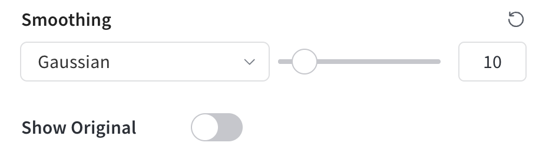
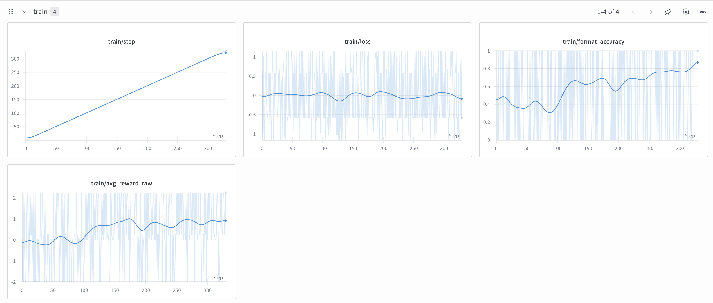

# Lab 2 - GRPO
## Announcement
Apologies for the delay in getting the lab working on the supercomputer. The lab was originally made on a different system which ended up having different versions of libraries than the supercomputer and required some adjustments. As a result, we have now made the lab shorter and provided more detailed instructions and scripts to help you get started.

## Getting Started
1. `cd grpo`
2. `uv venv --python 3.11`
3. `source .venv/bin/activate`
4. `uv run setup.py` ~10 minutes to setup the environment, download the models, and download the dataset.

### Wandb
1. We will be using wandb for logging instead of tensorboard for this lab. Wandb does require internet access, so we will jump through a few loops to get it working on the supercomputer.
1. For now, create or login to your wandb account at https://wandb.ai
2. Obtain an API key from https://wandb.ai/authorize
3. In the terminal, run `uvx wandb login` and paste your API key when prompted.
4. Start the wandb server in the background by running `wandb offline` in the terminal.
5. Once you start the training, on the login node, run `wandb sync --sync-all` to sync the logs to your wandb account whenever you want to sync the logs.

6. Please also apply Gaussian smoothing to the wandb plots to make them easier to read.

## Coding
1. Implement the 3 TODOs in grpo_lab.py.
2. The first TODO is to implement the GRPO_step function.
3. The second TODO is to implement the reward_correct function.
4. The third TODO is to implement the reward_format function.
5. For your convenience, we have provided a grpo_test_lab.py file that you can run on the login node to test your implementations. You can run `uv run grpo_test_lab.py` to run the tests. These methods will need to be changed slightly to run on the GPU, but this will help you get started. You can also use print statements and debugging to help you.

## Running the Lab
1. We will need at least 3 GPUs to run the lab. GPU 0 is for the ref_server.py, GPU 1 is for the generation in grpo_vllm_one.py, and GPU 2 will be for for the actual model being trained.
2. `sbatch scripts/start.sh` will submit the job to slurm. This will start the ref_server.py in the background and then start the grpo_vllm_one.py using deepspeed with both processes logging to the logs/ directory. Please look through the start.sh script to see how it works.
3. It will only take about 15 minutes to run the lab to get the format accuracy above 0.8.
4. Please remember `squeue -u <your-username>` to check the status of your job and `scancel <job-id>` to cancel your job if needed or `scancel -u <your-username>` to cancel all your jobs.

## Submitting the Lab
1. Please submit a picture of your wandb dashboard showing the training curves for format accuracy and avg reward. For full credit, format accuracy should be above 0.8.

