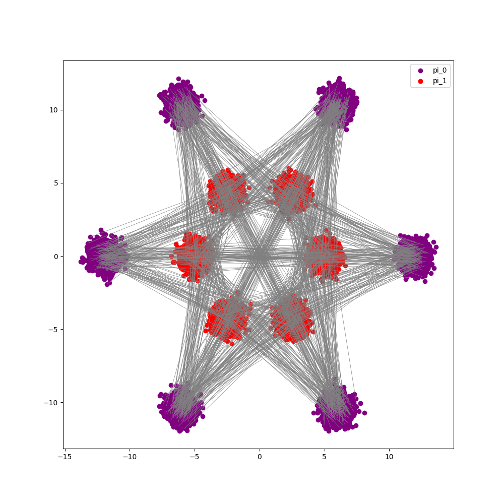
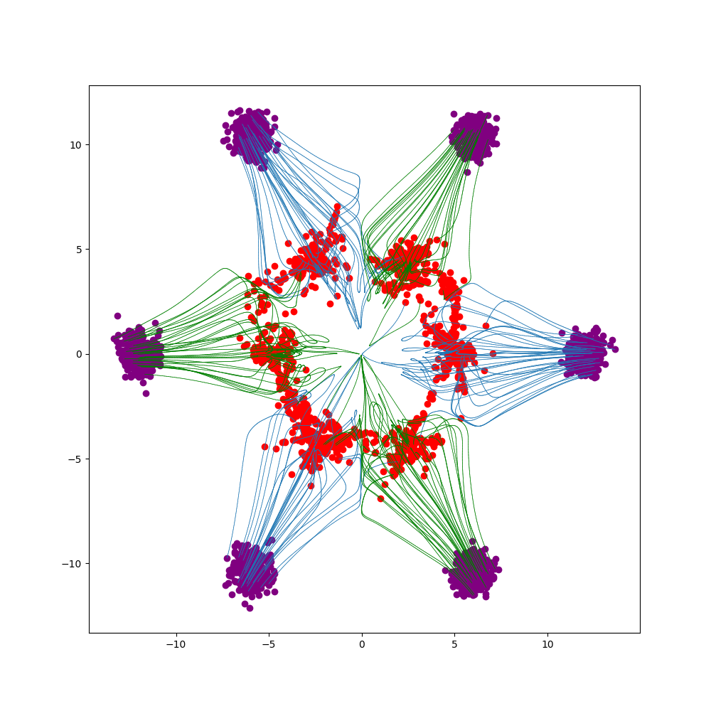
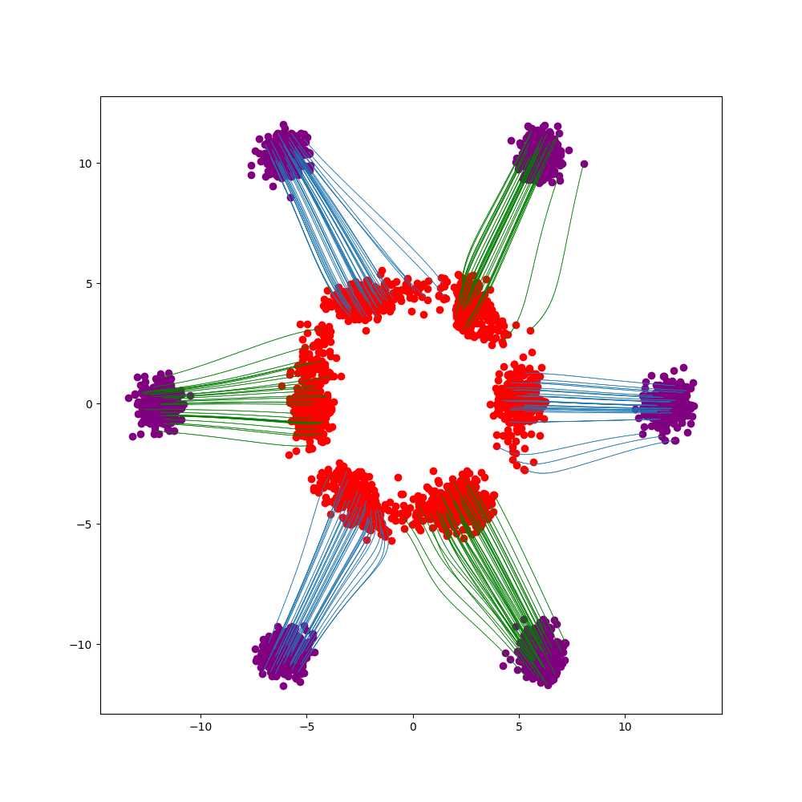
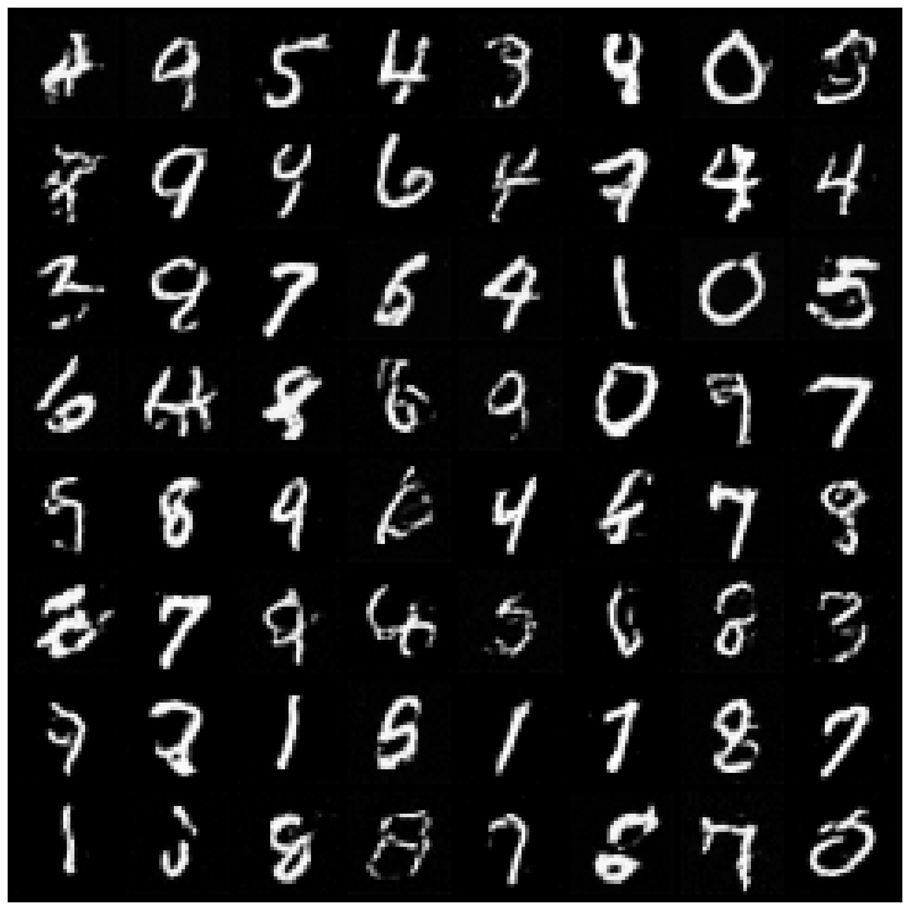

# Lab 5
## Rectified Linear Flow

## Introduction
Diffusion, flow-matching, etc models transform one distribution to another distribution in simplest form.

## Setup
This lab should be quite straightforward. It is just a single file (not super cleanly organized, apologies!) with 4 main parts. You are in charge of the environment setup, slurm scripts, and running the code.

This lab should be able to work in Google Colab as each step takes no longer than 5 minutes to run on an A100.

## 1 Linear Interpolation [No Code]
The simplest form of transforming one distribution to another is through linear interpolation. Please run `uv run main.py 1` to see this in action and ensure your environment is set up correctly. It should produce the following image:

## Step 2 1-Rectified Flow
Please implement step 2 `TODO: Part 2` by completing the training function in `main.py`. Run `uv run main.py 2` to train the model. This will produce trajectories that do not cross; however, they are not straight. It should produce the following image:

## Step 3 Reflowing
Please implement step 3 `TODO: Part 3` by completing the sampling function in `main.py`. Run `uv run main.py 3` to generate samples. We then train a model, generate samples or reflow, and train again which produces straighter trajectories. It should produce the following image:

## Step 4 MNIST
Please implement step 4 `TODO: Part 4` by completing the MNIST training function in `main.py`. Run `uv run main.py 4` to train and generate samples on the MNIST dataset. We can then generate an image in only 5 steps. It should produce the following image:

## Submission
Please submit images for all 4 steps and your code for review.